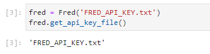

## Quantitative Investment Research & Strategy Develpment

### Project Hypothesis

Existing emperical evidence exists describing the relationship between [Credit Risk/Spreads](https://www.investopedia.com/terms/c/creditspread.asp) and equity markets. A paper published by the Bank for International Settlements (BIS), [Explaining Credit Default Swap Spreads with Equity Volatility and Jump Risks of Individual Firms](https://www.bis.org/publ/work181.pdf) concluded:

>>> A structural model with stochastic volatility and jumps implies particular relationships between observed equity returns and credit spreads. 

>>> Their empirical results suggest that volatility risk alone predicts 50% of CDS spread variation, while jump risk alone forecasts 19%.

In addition, the [Merton Model](https://www.investopedia.com/terms/m/mertonmodel.asp), which is an analysis model used to assess the credit risk of a company's debt, also finds a relationship between credit spreads and equity valuation levels. Analysts and investors utilize the Merton model to understand how capable a company is at meeting financial obligations, servicing its debt, and weighing the general possibility that it will go into credit default.

In 1974, economist Robert C. Merton proposed this model for assessing the structural credit risk of a company by modeling the company's equity as a call option on its assets. This model was later extended by Fischer Black and Myron Scholes to develop the Nobel-prize winning Black-Scholes pricing model for options.

> In short, the model predicts a non-linear negative link between the default likelihood and asset value of a firm.

Given the cost of obtaining Credit Default Swap data (preferred data but cost prohibitive), the use of Option Adjusted Spreads (OAS) is explored.  In addition, it is hypothesized that the use of a Machine Learning algorithm can be used to predict future equity market states.  See [Option-Adjusted Spread (OAS)](https://www.investopedia.com/terms/o/optionadjustedspread.asp) for a basic refresher on OASs. It is hypothesized that the OAS captures sufficient risk levels to be used as a predictive indicator for future equity market states.

For the purpose of this project, the the [SPDR® S&P 500® ETF Trust](https://www.ssga.com/us/en/intermediary/etfs/funds/spdr-sp-500-etf-trust-spy) was selected as a proxy for the Equity Market.  

The Feature Set Variable Names & FRED Mnemonic:
1. [ICE BofA US High Yield Index Option-Adjusted Spread (BAMLH0A0HYM2)](https://fred.stlouisfed.org/series/BAMLH0A0HYM2)
2. [ICE BofA US Corporate Index Option-Adjusted Spread (BAMLC0A0CM)](https://fred.stlouisfed.org/series/BAMLC0A0CM)
3. [ICE BofA BBB US Corporate Index Option-Adjusted Spread (BAMLC0A4CBBB)](https://fred.stlouisfed.org/series/BAMLC0A4CBBB)
4. [ICE BofA BB US High Yield Index Option-Adjusted Spread (BAMLH0A1HYBB)](https://fred.stlouisfed.org/series/BAMLH0A1HYBB)
5. [ICE BofA CCC & Lower US High Yield Index Option-Adjusted Spread (BAMLH0A3HYC)](https://fred.stlouisfed.org/series/BAMLH0A3HYC)

The Random Forest Classifier Model and RandomizedSearchCV are used to develop a Naive Model and Optimal Model to determine if either model can deliver an annual return higher than the [SPDR® S&P 500® ETF Trust](https://www.ssga.com/us/en/intermediary/etfs/funds/spdr-sp-500-etf-trust-spy).  The Optimal Model also attempts to achieve a superior annual rate of return by using model parameters obtained from RandomizedSearchCV (process described below).

The hypothesis may be summarized as follows:

> Lagged values for the daily change in OASs across different credit ratings can predict the future state of equity markets.

It is also recommended that the user read [Project_3_Presentation](Project_3_Presentation.pptx) prior to proceeding further, as it provides additional context for the user.

### Project Notebooks

**Notebook:  [SourceData.ipynb](SourceData.ipynb)**

This notebook retrieves data for both the feature and target sets:

The data for the Feature Set is obtained from [FRED](https://fredhelp.stlouisfed.org/fred/about/about-fred/what-is-fred/) using their API services and library named `from full_fred.fred import Fred`.  See the "Usage Instructions" section below on obtaining and saving the API from FRED.

Of note, this notebook also obtains data for other economic time series, but only OAS data for the above data series are used for modeling purposes.

The data for the Target Set data is obtained from yahoo Finance using their `import yfinance as yf` library.  As noted above, the [SPDR® S&P 500® ETF Trust](https://www.ssga.com/us/en/intermediary/etfs/funds/spdr-sp-500-etf-trust-spy) is the target set.

All raw data and data from the constructed data frames as saved as .csv files to the [AutoOutputFiles](AutoOutputFiles) folder for use by other notebooks.

**Notebook:  [rfc_model_feature_set_analysis.ipynb](rfc_model_feature_set_analysis.ipynb)**

This note book is used for data visualization and analysis of Feature Set variables to gain an understanding of their relationship with one another and how they may impact the quality of modeling results.  Analysis concludes that the daily rate of return for the OAS time series should be used for modeling, as the linear relationship that appears for the OAS Levels data is removed.  

A simple line plot confirms that some relationship exists between OAS levels and this relationship is likely time dependent as well.  The OAS levels are transformed into daily percentage changes and these values are used for modeling purposes.

The Pearson Correlation Coefficient was used to confirm that the correlation between the daily percentage change in OAS is less than the correlation for OAS levels.

The `hvplot.scatter_matrix()` method was used to also confirm that this apparent relationship between OAS levels is removed when transforming them into daily percentage changes.

An analysis on the distribution (density plot) for the OAS Levels and Daily Percentage Changes using `hvplot.kde()` also concluded that daily percentage changes were more appropriate for modeling purposes.

An understanding of the disperion of OAS levels and rates of change was gained through the use of hvplot.violin().

`hvplot.lag_plot()` was used to gain an understanding of any lagged relationships between the feature set variables.

Finally, an analysis of the two features exhibiting the highest degree of positive correlation was conducted using `.hvplot.bivariate()`

**Notebook:  [rfc_model_target_feature_set_lag_analysis.ipynb](rfc_model_target_feature_set_lag_analysis.ipynb)**

Given that understanding the lagged relationship between the feature and target set is critical to the success of the investment strategy, this notebook is dedicted to visualizing lagged relationships between the feature set and target set.  This notebook also uses the `hvplot.lag_plot()` method and each OAS feature was paired with the data for the equity's daily price returns.

**Notebook:  [Current_rfc_model_optimal_lag_grid_automated.ipynb](Current_rfc_model_optimal_lag_grid_automated.ipynb)**

The runtime for this notebook is approximately 2 hours and is used for both the Naive & Optimal Model Versions.  

Critical time periods used for research and development:

1. Training Period Start Date = October 25, 2011 (Held constant for all in-sample testing)
2. Training Period End Date = December 14, 2018 (Held constant for all in-sample testing)
3. Testing Period Start Date = December 15, 2018 (Held constant for all in-sample testing)
4. Testing Period End Dates was varied to allow for average model parameters to be calculated when using RandomizedSearchCV to determine optimal model parameters.  The testing period range is between October 1, 2021 to October 15, 2021
5.  Forward Test Start Date = Monday, October 18, 2021

**Naive Model**

The Naive Model arbitrarily sets the following values for the RandomForestClassifier (RFC) and all other parameters use default settings:

`n_estimators = 500`
`max_depth = 5,000`
`max_features = 'auto'`

Daily lagged values for the percentage change in OAS, ranging between 1 and 90 days, were analyzed for the Naive Model. The same parameter values listed immediately above were used for the RFC on each iteration. The RFC model is manually split into training and testing time periods and the notebook is run for each period ending between October 1, 2021 to October 15, 2021.  The results from each days analysis is saved and mannually aggregegated into one file to determine which lag delivered the highest average annualized rate of return over the test period.  The use of a third partly library, pyfolio, was used to calculate the following performance statistics:

`empyrical.annual_return(algo_performance_series)`

`empyrical.annual_volatility(algo_performance_series)`

`empyrical.sharpe_ratio(algo_performance_series)`

`empyrical.calmar_ratio(algo_performance_series)`

`empyrical.max_drawdown(algo_performance_series)`

`empyrical.sortino_ratio(algo_performance_series)`

`empyrical.alpha(algo_performance_series,Equity_performance_series)`

`empyrical.beta(algo_performance_series,Equity_performance_series)`

The notebook also plots the above statiscs by lag for the Naive Model's current period end.

On each iteration, a .csv and .joblib version of the model is saved to the following location, where i = lag value, testing_end = period end date is the `fl_nm` variable:

**.joblib files saved for future use**

`fl_nm = 'model_candidates/nieve/Lag_' + str(i) + '_random_forest_' + testing_end + '.joblib'`
`joblib.dump(model, fl_nm, compress=3)` 

The following image illustrates the file versions for the 90 day lag

**.csv contains the cumulative performance of the strategy version compared with SPY**

`fl_nm = 'AutoOutputFiles/Lag_' + str(i) + '_df_performance_results_' + testing_end + '.csv'`

The following image illustrates the file versions for the 90 day lag

The following files contain the computed performance statistics using the `empyrical` library and the October 1, 2021 to October 15, 2021 results are averaged to determine which lag produced the highest annual return expectation over this period.

`fl_nm = 'AutoOutputFiles/df_strat_lag_' + testing_end + '.csv'`
`df_strat_lag.to_csv(fl_nm)`

Caputre statistics are also computed and the same aggregation and averaging process is understaken.

`fl_name = 'AutoOutputFiles/df_capture_stats_' + testing_end + '.csv'`

`df_capture_stats.to_csv(fl_name)`

The capture statistics that are produced by the notebook:

`EquityDays = 'Total trading days in test period'`

`EquityDaysPositive = 'Total positive equity return days in test period'`

`EquityDaysNegative = 'Total negative equity return days in test period'`

`StrategyDaysInEquity = 'Total days the strategy was invested in the equity security'`

`StrategyDaysInCash = 'Total days the strategy was invested in cash'`

`StrategyCapturePositive = 'Of the equity's positive days, how many days did the strategy capture'`

`StrategyCaptureNegative = 'Of the equity's negative days, however may days did the strategy capture'`

`EquityDays>=1% = 'Total number of days the equity delivered a return greater than or equal to 1%:  Positive Extreme'`

`EquityDays<=-1% = 'Total number of days the equity delivered a return less than or equal to -1%:  Negative Extreme'`

`StrategyCaptureExtremePositive = 'For the equity's positive extreme days, how many days did the strategy capture'`

`StrategyCaptureExtremeNegative = 'For the equity's negative extreme days, how many days did the strategy capture'`

**Optimal Model**

Where the Naive Model arbitrarily sets RFC parameters, the Optimal Model uses [RandomizedSearchCV](https://scikit-learn.org/stable/modules/generated/sklearn.model_selection.RandomizedSearchCV.html) and the `best_params_` method, while iterating over a range of parameter values to determine which average value leads to the highest annual return expectation. The model parameters and the range of values include:

`forest_params = [
        {
            'max_depth': list(range(9, 6001)), 
            'max_features': list(range(1,6)),
            'n_estimators': list(range(1,1001)),
            'min_samples_split': list(range(1,51))
        }
    ]`

The RandomizedSearchCV also takes on the following parameters and assocated values: 

`cv_value = 5`

`scoring='accuracy'`

The daily results are saved to the following location and later manually aggregated into one file for use in [AggregatedStatistics.ipynb](AggregatedStatistics.ipynb) to determine the average parameter values over the October 1, 2021 to October 15, 2021 in-sample period.

`fl_name = 'AutoOutputFiles/df_best_params_' + testing_end + '.csv'`

`df_best_params.to_csv(fl_name)`

The following image illustrates the file versions for the in-sample period:

The bottom portion of this notebook relates to the optimal model paramters for the current run and the data is also plotted for visual review.  The mean, standard deviation, skew, and kurtosis for the current runs parameters, accross all lags, is also computed to describe the distribution of values.

**Notebook:  [AggregatedStatistics.ipynb](AggregatedStatistics.ipynb)**

Based on the results from the October 1, 2021 to October 15, 2021 training and testing periods, the Mean Annualized Return Per Feature Lag In Days was calculated for the Naive Model and the lagged period with the highest average return was selected for Forward Testing purposes.  The standard deviation and skew are also calculated for future use.  The 27 day lagged period produced the highest average annual return during the in-sample period.

This notebook also calculates the mean parameter values accross all lags to arrive at mean parameter values used for the Optimal Model.  Based on the October 1, 2021 - October 15, 2021 analysis, the paramter values used for the Optimal Model were:

`n_estimators = 477.0`

`min_samples_split = 31.0`

`max_features = 3.0`

`max_depth = 2988.0`

These values are used in the next notebook.

**[Current_rfc_model_algo_optimal_params_all_avg.ipynb](Current_rfc_model_algo_optimal_params_all_avg.ipynb)**

The parameter values noted immediately above are held constant for all lags.  The RFC model with these parameters are once again trained and tested on the Obtober 1, 2021 - October 15, 2021 time periods.  The resulting analysis from the daily runs is then manually aggregated to determine which lag produced the highest average annual return over the test period.  Once the manual file has been constructed, the user can run [AggregatedStatistics.ipynb](AggregatedStatistics.ipynb) again to determine which lag produced the highest expected annual return.  The plot named 'Mean Annualized Return Per Feature Lag In Days (Using Mean RandomizedSearchCV Model Parameters)' within the [AggregatedStatistics.ipynb](AggregatedStatistics.ipynb) notebook confirms that a 30 Day lag with the 'optimaized parameters' should be selected for forward testing purposes.

As with the Naive Model, capture statistics are also calculated and saved, where i = lag value and testing_end = period end date:

`fl_name = 'algo_optimal_parameters/back_test_using_mean_grid_values/df_capture_stats_' + testing_end + '.csv'`

The .joblib version for each model is saved here:

`fl_nm = 'algo_optimal_parameters/back_test_using_mean_grid_values/Lag_' + str(i) + '_random_forest_' + testing_end + '.joblib'`

`joblib.dump(model, fl_nm, compress=3)`

The .csv files containing the performance metrics for each model version over each testing date:

`fl_nm = 'algo_optimal_parameters/back_test_using_mean_grid_values/Lag_' + str(i) + '_df_performance_results_' + testing_end + '.csv'`

**Notebook:  [Current_rfc_optimal_model_accuracy_feature_importance.ipynb](Current_rfc_optimal_model_accuracy_feature_importance.ipynb)**

Once it was determined that the Optimal Model should use a 30 day lag of feature set variables along with `n_estimators = 477.0`, `min_samples_split = 31.0`, `max_features = 3.0`, and `max_depth = 2988.0` this notebook was constructed to determine the 

1. Feature Importance (Gini Importance or Mean Decrease in Impurity (MDI)), and
2. RFC model accuracy levels during the in-sample training and testing periods

Evidence exists that the feature set should be reduced and only include the features at index 0, 3, and 4.  For your reference, these are:
1. Feature 0 Index:  ICE BofA US High Yield Index Option-Adjusted Spread (BAMLH0A0HYM2)
2. Feature 3 Index:  ICE BofA BB US High Yield Index Option-Adjusted Spread (BAMLH0A1HYBB)
3. Feature 4 Index:  ICE BofA CCC & Lower US High Yield Index Option-Adjusted Spread (BAMLH0A3HYC)

This additional test will be conducted in the future.

Evidence also exists that the optimal model may suffer from overfitting as the accuracy scored experienced a material decline during the testing period.  The Forward Testing Period will be used to confirm if overfitting is an actual issue with the model.

RFC Accuracy During Training Period: TRAINING 0.8709315375982043

RFC Accuracy During Testing Period: TESTING 0.5686274509803921

All results reflect a testing period ending on October 15, 2021.

**Notebook:  [nieve_vs_random_grid_search_backtest_comparison.ipynb](nieve_vs_random_grid_search_backtest_comparison.ipynb)**

At this stage we have determined that the following models should be used for forward testing:
1. Naive Model With 27 Day Lag and Naive Parmaters
2. Optimal Model With 30 Day Lag and Optimal Parameters

A cumulative return plot for the Equity Security, Naive Model, and Optimal Model during the in-sample testing period was constructed to understand the return path for each.  This analysis helps in answering:
1. Were strategy returns earned during volatile periods?
2. Were strategy returns earned during up markets or down markets?
3. Are there periods where one outperforms the other and how consistently does this occur?

Evidence exists that the Naive model offers better downside risk protection, but at the expense of some return.

Evidence exists that the Optimal Model capture more downside risk, however delivers superior return for the majority of the test period.

By the end of the test period, the unitized cumulative return for the Naive & Optimal Model are converging, suggesting that a longer test period may be required to understand which model is most appropriate.  The Forward Test results are also expected to aid in this endeavour, however a backtested version is ideal to conduct additional testings.

Currently under development, this notebook also contains preliminary work for comparing the Capture Statistics for both the Naive and Optimal Model.  This numerical analysis compliments the return path analysis.

**Notebook:  [rfc_model_naive_forward_testing_v0004.ipynb](rfc_model_naive_forward_testing_v0004.ipynb)**

This notebook represents the Forward Testing for the Naive Model.

The `model_candidates/nieve/Lag_27_random_forest_2021-10-15.joblib` model is loaded for out-of-sample (Forward Test) purposes.  Given the project dealine, only 6 Forward Test results are currently available for the following dates:

`2021-10-18, 2021-10-19, 2021-10-20, 2021-10-21, 2021-10-22, and 2021-10-25`

The results are currently stored within a Pandas Series, with eventual plans of storing in a Pandas Data Frame.  Given that only 6 out-sample-results are available, the code that returns the forward test predictions, `new_predictions = all_new_predictions.iloc[-6:]`, is manually updated (next day's value = -7) the following day's run.

**Notebook:  [rfc_model_optimal_forward_testing_v0004.ipynb](rfc_model_optimal_forward_testing_v0004.ipynb)**

This notebook represents the Forward Testing for the Optimal Model.

The `algo_optimal_parameters/back_test_using_mean_grid_values/Lag_30_random_forest_2021-10-15.joblib` model is loaded for out-of-sample (Forward Test) purposes.  Given the project dealine, only 6 Forward Test results are currently available for the following dates:

`2021-10-18, 2021-10-19, 2021-10-20, 2021-10-21, 2021-10-22, and 2021-10-25`

The results are currently stored within a Pandas Series, with eventual plans of storing in a Pandas Data Frame.

Let the Forward Test Battle Begin - well, only 6 days thus far!

### Usage Instructions

#### FRED API KEY

The FRED API is used to obtain Option Adjusted Spread data, which represents the feature set data for model purposes.  The following steps outline the process for obtaining the required API key and saving for use in the FRED library.

1. Sign-Up for a free account and API Key at [St. Loius Fed User Account & API Key Request](https://research.stlouisfed.org/useraccount/apikey)

>>> What is FRED? Short for Federal Reserve Economic Data, FRED is an online database consisting of hundreds of thousands of economic data time series from scores of national, international, public, and private sources. FRED, created and maintained by the Research Department at the Federal Reserve Bank of St. Louis, goes far beyond simply providing data: It combines data with a powerful mix of tools that help the user understand, interact with, display, and disseminate the data. In essence, FRED helps users tell their data stories. The purpose of this article is to guide the potential (or current) FRED user through the various aspects and tools of the database.

2. Record the API Key obtained in step 1 within a text file named `FRED_API_KEY.txt` and save this file within the same folder as the jupyter lab code.

3. Install [full_fred](https://pypi.org/project/full-fred/) using the following command within your environment:  `pip install full-fred`

>>> full_fred is a Python interface to FRED (Federal Reserve Economic Data) that prioritizes user preference, flexibility, and speed. full_fred's API translates to Python every type of request FRED supports: each query for Categories, Releases, Series, Sources, and Tags found within FRED's web service has a method associated with it in full_fred. full_fred minimizes redundant queries for the sake of users and FRED's servers. After a request for data is made to FRED web service the retrieved data is stored in a dictionary, accessible and fungible

4. [Full Fred Module Dependencies](https://github.com/7astro7/full_fred/blob/master/requirements.txt)

The following block of code with notebook [SourceData.ipynb](SourceData.ipynb) can be used to confirm the successful intallation of full_fred:

#### Pyfolio Library

1. [pip install pyfolio-reloaded](https://pypi.org/project/pyfolio-reloaded/)

> pyfolio is a Python library for performance and risk analysis of financial portfolios

> At the core of pyfolio are various tear sheets that combine various individual plots and summary statistics to provide a comprehensive view of the performance of a trading algorithm.

> The tear sheet presents performance and risk metrics for the strategy separately during the backtest and out-of-sample periods

> *NB:  This library has known issues and only a subset of the functionality has been used.  The only approach to address this issue requires the user to change the source code in severaly modules, which is not best practice.  [pyfolio IndexError: index -1 is out of bounds for axis 0 with size 0 #661](https://github.com/quantopian/pyfolio/issues/661)  The benefits of using this library outweight this issue, as only the test period was of primary concern, although it is ideal to have the in-sample and out-of-sample results available.*

#### yFinance

1. [pip install yfinance](https://pypi.org/project/yfinance/)

> Yahoo! Finance market data downloader

> Ever since Yahoo! finance decommissioned their historical data API, many programs that relied on it to stop working.

> yfinance aims to solve this problem by offering a reliable, threaded, and Pythonic way to download historical market data from Yahoo! finance.

#### Full Library Requirements

Refer to the [Requirements](Requirements.txt) for the all the liraries required to execute the notebooks.
